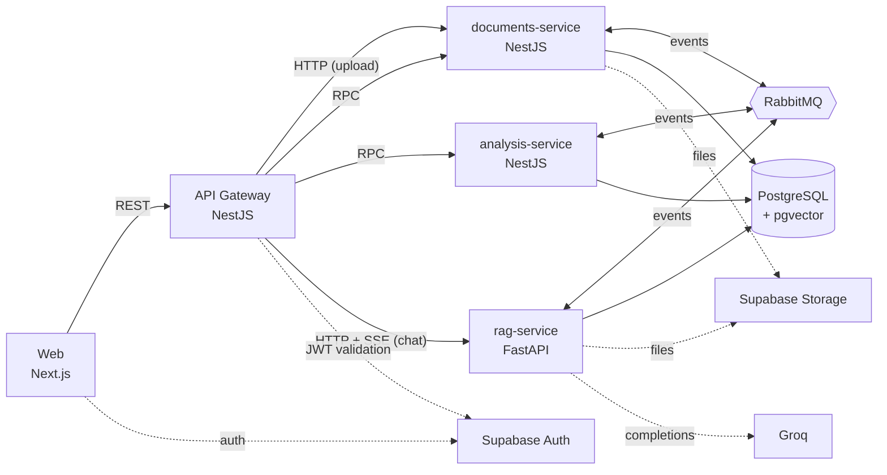
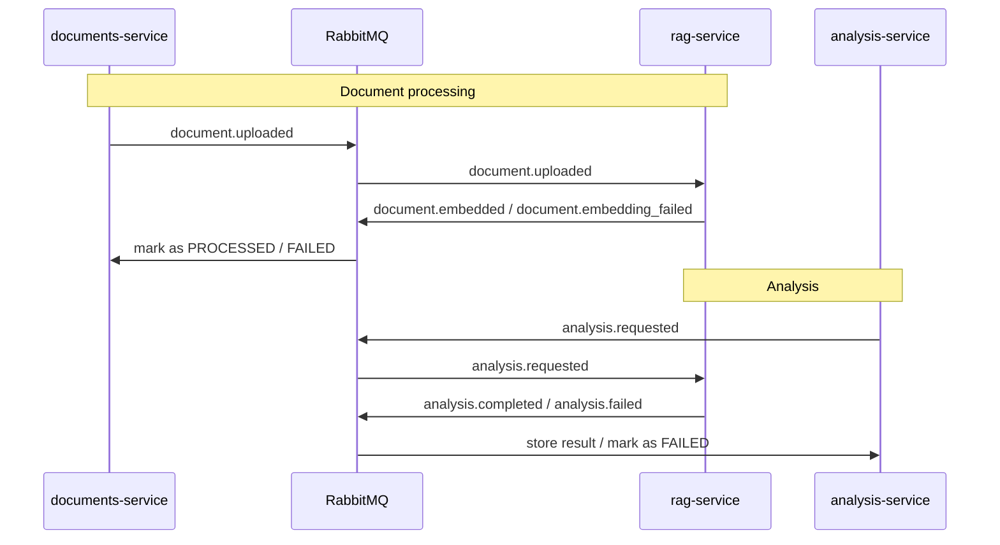

# Clarus

> Turn financial documents into precise, structured answers.

Clarus is a SaaS platform for financial document analysis. Users upload contracts, invoices, and reports, then either run **structured actions** (Summary, Extract values, Deadlines, Comparison) or **chat** with their documents. Answers are generated with retrieval-augmented generation (RAG), grounded in the content of the user's own files.

## Live demo

[clarus-delta.vercel.app](https://clarus-delta.vercel.app)

[**Watch a walkthrough video**](https://www.youtube.com/watch?v=oe_7RHXJXkA)

The backend services run on Render's free tier, which puts them to sleep after a period of inactivity. Before trying the demo, open each health check link below once — this wakes up the services, which can take 30-60 seconds. Without this, the first request may fail with an error page.

| Service | Health check |
|---|---|
| API Gateway | [clarus-api-gateway.onrender.com/health](https://clarus-api-gateway.onrender.com/health) |
| documents-service | [clarus-documents-service.onrender.com/health](https://clarus-documents-service.onrender.com/health) |
| analysis-service | [clarus-analysis-service.onrender.com/health](https://clarus-analysis-service.onrender.com/health) |
| rag-service | [clarus-rag-services.onrender.com/health](https://clarus-rag-services.onrender.com/health) |

## Features

- Document upload with asynchronous processing (text extraction, chunking, embeddings)
- Four structured analyses per document, with status tracking (pending, completed, failed) and retry
- Streaming chat over the user's documents (Server-Sent Events)
- Sign-in with Google, GitHub, or email and password
- Account management: profile, email, password, connected accounts, sessions, account deletion
- Per-user data isolation

## Architecture



### Event flows



## Services

| Service | Stack | Responsibility |
|---|---|---|
| [`web`](apps/web/README.md) | Next.js (App Router), TypeScript, Tailwind CSS v4, shadcn/ui | Landing page, authentication, dashboard |
| [`api-gateway`](apps/api-gateway/README.md) | NestJS | Single entry point: validates the Supabase JWT and routes requests to the services. No database |
| [`documents-service`](apps/documents-service/README.md) | NestJS, Prisma | Document lifecycle: upload, listing, status, soft delete |
| [`analysis-service`](apps/analysis-service/README.md) | NestJS, Prisma | Analysis requests and results |
| [`rag-service`](apps/rag-service/README.md) | Python, FastAPI, Pydantic, SQLAlchemy, Alembic, PgVector | Text extraction, embeddings, retrieval, LLM calls, chat |
| [`event-contracts`](packages/event-contracts/README.md) | TypeScript, Zod | Shared messaging topology and event schemas |

## Design decisions

**Choreographed saga instead of orchestration.** The flows (upload to embedding, analysis request to result) are short and linear, so each service just publishes an event when its step finishes and the next one reacts. There is no central coordinator to build and keep in sync with every service, and no extra hop between steps, which keeps latency low. The trade-off is that the full flow isn't defined in one place; with few services and events, all named in a single shared package, that cost stays small.

**Three communication styles, each where it fits.**
- Events over RabbitMQ (topic exchange) for saga steps between services.
- RPC over RabbitMQ, using the same library, for reads and commands from the gateway to the NestJS services.
- Plain HTTP where the payload is not message-shaped: multipart upload from the gateway to `documents-service`, and streamed chat responses (SSE) from `rag-service`.

**Clean Architecture in the NestJS domain services.** Each service is split into `domain`, `application`, `infrastructure`, and `presentation`, with dependencies pointing inward. Entities hold the business rules, and use cases depend on ports (repository, file storage, event publisher) that Prisma, RabbitMQ, and Supabase Storage implement, so business logic never depends on them and each one can be swapped without touching it.

**Shared contracts across two languages.** `@clarus/event-contracts` holds the exchange, queue, and routing key names and the Zod schemas for events. For the events that cross into Python, the same shapes are also published as JSON Schema, and the Pydantic models in `rag-service` are generated from them, so there is a single source of truth instead of hand-maintained copies.

**Per-user isolation.** Each user is their own tenant. The gateway derives the user ID from the validated Supabase JWT and never trusts one sent by the client. Use cases verify ownership and return "not found" instead of "forbidden" on a mismatch, so the existence of other users' resources isn't revealed.

**One PostgreSQL instance, one schema per service.** Logical isolation without running a database per service: schemas are managed independently, and services reference each other by ID only, with no cross-schema foreign keys. NestJS services use Prisma's multi-schema support; `rag-service` uses SQLAlchemy and Alembic, with pgvector for embeddings.

## Repository structure

```
.
├── apps/
│   ├── web/                  # Next.js frontend
│   ├── api-gateway/          # NestJS gateway
│   ├── documents-service/    # NestJS + Prisma
│   ├── analysis-service/     # NestJS + Prisma
│   └── rag-service/          # FastAPI
├── packages/
│   └── event-contracts/      # Shared topology and event schemas
├── docker-compose.yml        # RabbitMQ + PostgreSQL (pgvector) for local development
├── init-schemas.sql          # Creates one schema per service
└── pnpm-workspace.yaml
```

## Getting started

### Prerequisites

- Node.js (LTS) and [pnpm](https://pnpm.io/)
- Python and [uv](https://docs.astral.sh/uv/)
- Docker
- A Supabase project with Google and GitHub providers enabled, plus a Storage bucket for uploaded files
- API keys for the LLM and embedding providers used by `rag-service`

### Run locally

```bash
# 1. Start RabbitMQ and PostgreSQL (schemas are created automatically on first run)
docker compose up -d

# 2. Create a .env file in each service (each service's README lists its variables)

# 3. Install dependencies, build the shared contracts, run the Prisma migrations, and apply the rag-service migrations
pnpm run setup

# 4. Start every service in a single terminal
pnpm dev
```

`pnpm dev` runs the web app, the API gateway, and the three domain services together. The web app is served at `http://localhost:3000`, and RabbitMQ's management UI at `http://localhost:15672` (`guest` / `guest`).

Use `pnpm run setup`, not `pnpm setup`, which is a built-in pnpm command.